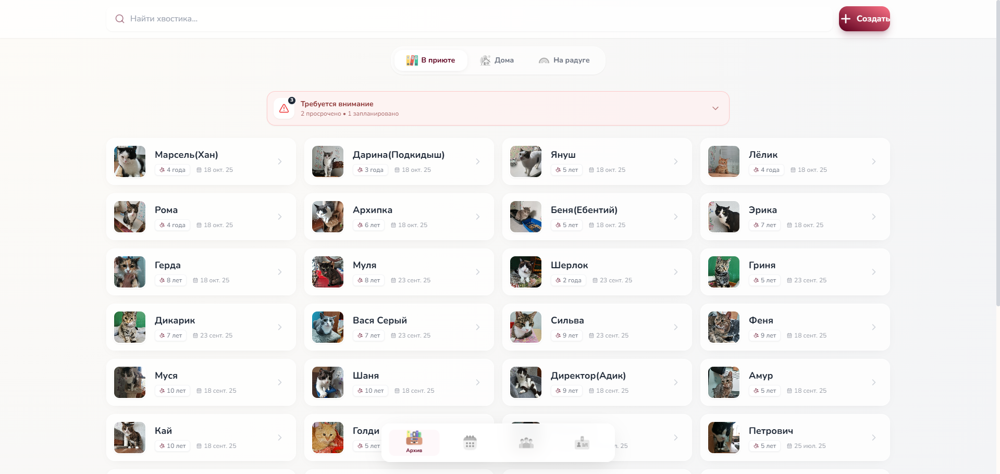
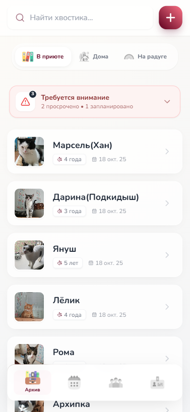
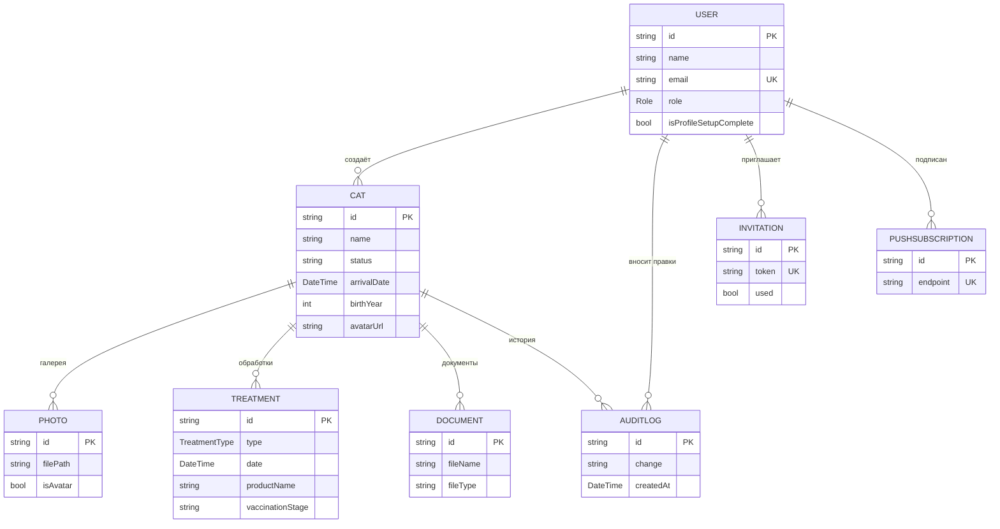

<div align="center">

# 🐾 Murdom — система учёта и управления кошачьим приютом

**Прогрессивное веб-приложение (PWA) для волонтёров и сотрудников приюта:**
учёт животных, медицинская история, документы, напоминания о вакцинации
и публичные карточки для пристройства.

<br/>


<br/>


</div>

---

## 📋 Содержание

- [О проекте](#-о-проекте)
- [Возможности](#-возможности)
- [Скриншоты](#-скриншоты)
- [Технологический стек](#-технологический-стек)
- [Архитектура и модель данных](#-архитектура-и-модель-данных)
- [Роли и права доступа](#-роли-и-права-доступа)
- [Быстрый старт](#-быстрый-старт)
- [Переменные окружения](#-переменные-окружения)
- [Структура проекта](#-структура-проекта)
- [Доступные команды](#-доступные-команды)
- [Автор](#-автор)

---

## 🎯 О проекте

**Murdom** — это полнофункциональная информационная система для кошачьего приюта,
разработанная как современное прогрессивное веб-приложение. Система решает реальные
задачи приюта: ведение карточек животных, отслеживание медицинских процедур и прививок,
хранение документов, управление командой волонтёров и помощь в поиске дома для животных.

Приложение устанавливается на устройство как нативное (PWA), работает на десктопе и
мобильных, поддерживает push-уведомления и разграничение прав доступа по ролям.

**Ключевые идеи проекта:**

- 📱 **Mobile-first PWA** — устанавливается на телефон, ощущается как нативное приложение.
- 🔐 **Ролевая модель доступа** — волонтёры, мед. персонал, доверенные лица, администраторы.
- 🩺 **Медицинский трекинг** — автоматические напоминания о ревакцинации по календарю.
- 🌍 **Публичные карточки пристройства** — красивая ссылка с превью для соцсетей.

---

## ✨ Возможности

### Учёт животных
- 🐱 Карточки кошек: фото, возраст, дата прибытия, статус (`В приюте` / `Дома` / `На радуге`).
- 🔍 Поиск по кличке и фильтрация по статусу.
- 📊 **Сводная статистика приюта**: счётчики по статусам, распределение, ближайшие вакцинации.
- 🗂️ Массовое выделение и удаление (long-press на мобильных).

### Медицина и документы
- 💉 История обработок и прививок с этапами вакцинации.
- ⏰ **Автоматические напоминания** о ревакцинации (просроченные / на этой неделе).
- 📄 Документы: загрузка, **сканирование через камеру**, просмотр.
- 🖼️ Фотогалерея с выбором аватара.
- 🕐 **Хроника** — единая лента событий жизни котика в приюте.
- 📥 **Экспорт карты животного в PDF** (вместе с прикреплёнными изображениями).

### Команда и безопасность
- 👥 Управление сотрудниками и приглашения по одноразовым ссылкам.
- 🔑 Аутентификация по email/паролю (хеширование `bcrypt`).
- 📜 **Журнал аудита** — кто и когда вносил изменения.
- 🛡️ Разграничение прав по ролям на уровне UI и API.

### Пристройство и UX
- 🏡 **Публичная карточка пристройства** (`/adopt/[id]`) с Open Graph / Twitter превью.
- 📤 Кнопка «Поделиться» (Web Share API / копирование ссылки).
- 🎞️ Плавные анимации и переходы (Framer Motion): пружинистые нажатия, hover-эффекты,
  скелетоны загрузки, свайп-переход между разделами с эффектом глубины.
- 📲 **Push-уведомления** (Web Push + VAPID).
- 🌐 Офлайн-готовность и установка как приложение (Service Worker, manifest).

---

## 📸 Скриншоты

<div align="center">

| Десктоп — Дашборд | Мобильная версия |
|:---:|:---:|
|  |  |

</div>

---

## 🛠 Технологический стек

| Слой | Технологии |
|------|-----------|
| **Frontend** | Next.js 14 (App Router), React 18, TypeScript 5 |
| **Стилизация** | Tailwind CSS, Framer Motion, lucide-react |
| **Backend** | Next.js Route Handlers (REST API), Node.js |
| **База данных** | SQLite + Prisma ORM |
| **Аутентификация** | NextAuth.js (Credentials), bcrypt |
| **Формы и валидация** | React Hook Form, Zod |
| **Медиа** | sharp (обработка изображений), react-webcam (сканер) |
| **Документы** | jsPDF, html2canvas (экспорт в PDF) |
| **Уведомления** | web-push (VAPID) |
| **PWA** | Service Worker, Web App Manifest |
| **Утилиты** | date-fns, fuse.js, use-debounce |

---

## 🗂 Архитектура и модель данных

Приложение построено на **Next.js App Router**: серверные компоненты и Route Handlers
обращаются к БД через Prisma, клиентские компоненты отвечают за интерактив и анимации.
Доступ к защищённым маршрутам контролируется через `middleware.ts` (NextAuth).



> Помимо доменных моделей, схема включает таблицы NextAuth (`Account`, `Session`,
> `VerificationToken`) для управления сессиями.

---

## 🔐 Роли и права доступа

| Роль | Просмотр | Редактирование карточек | Управление командой |
|------|:---:|:---:|:---:|
| 🌱 **Волонтёр** (`VOLUNTEER`) | ✅ | ❌ | ❌ |
| 🩺 **Мед. персонал** (`MEDICAL_STAFF`) | ✅ | ✅ | ❌ |
| 🛡️ **Доверенное лицо** (`TRUSTED_PERSON`) | ✅ | ✅ | ❌ |
| ⚡ **Администратор** (`DEVELOPER`) | ✅ | ✅ | ✅ |

Права проверяются **дважды** — на клиенте (скрытие действий в UI) и на сервере
(в Route Handlers перед операциями с БД).

---

## 🚀 Быстрый старт

### Требования
- **Node.js** 18.17+
- **npm**

### Установка и запуск

```bash
# 1. Установить зависимости
npm install

# 2. Создать файл .env (см. раздел ниже) и сгенерировать Prisma Client
npx prisma generate

# 3. Применить миграции и наполнить базу тестовыми данными
npx prisma migrate deploy
npm run prisma:seed

# 4. Запустить в режиме разработки
npm run dev
```

Приложение будет доступно на **http://localhost:3000**.

> 💡 **Демо-доступ** (создаётся сидом): `admin@gmail.com` / `12345` (роль «Администратор»).

### Production-сборка

```bash
npm run build
npm run start
```

---

## ⚙️ Переменные окружения

Создайте файл `.env` в корне проекта:

```env
# База данных (SQLite)
DATABASE_URL="file:./dev.db"

# NextAuth
NEXTAUTH_SECRET="ваш-секретный-ключ"
NEXTAUTH_URL="http://localhost:3000"

# Базовый URL приложения (для ссылок и Open Graph превью)
NEXT_PUBLIC_APP_URL="http://localhost:3000"

# Push-уведомления (Web Push / VAPID) — опционально
VAPID_PUBLIC_KEY=""
VAPID_PRIVATE_KEY=""
VAPID_SUBJECT="mailto:admin@example.com"

# Контакт приюта для публичной карточки пристройства — опционально
NEXT_PUBLIC_SHELTER_CONTACT=""
```

| Переменная | Назначение | Обязательна |
|-----------|-----------|:---:|
| `DATABASE_URL` | Путь к базе SQLite | ✅ |
| `NEXTAUTH_SECRET` | Ключ подписи сессий NextAuth | ✅ |
| `NEXTAUTH_URL` | URL приложения для NextAuth | ✅ |
| `NEXT_PUBLIC_APP_URL` | Базовый URL (ссылки, OG-превью) | ✅ |
| `VAPID_*` | Ключи для push-уведомлений | ⬜ |
| `NEXT_PUBLIC_SHELTER_CONTACT` | Контакт на карточке пристройства | ⬜ |

---

## 📁 Структура проекта

```
MurdomV2/
├── app/
│   ├── adopt/[id]/         # Публичная карточка пристройства (OG-превью)
│   ├── api/                # REST API (Route Handlers)
│   │   ├── auth/           # NextAuth
│   │   ├── cats/           # CRUD кошек, фото, документы, обработки, аудит
│   │   ├── push/           # Подписки и отправка push-уведомлений
│   │   └── staff/          # Сотрудники и приглашения
│   ├── dashboard/          # Дашборд, карточки и профили кошек, календарь
│   ├── components/         # Переиспользуемые UI-компоненты, AppShell, навигация
│   ├── login/ register/    # Аутентификация и регистрация по приглашению
│   └── layout.tsx          # Корневой layout, PWA, провайдеры
├── lib/                    # Prisma client, auth, бизнес-логика (вакцинация)
├── hooks/                  # Кастомные хуки (useLongPress и др.)
├── prisma/                 # Схема, миграции, сид
├── public/                 # Иконки, manifest, service worker, скриншоты
├── types/                  # Общие TypeScript-типы
└── middleware.ts           # Защита маршрутов (NextAuth)
```

---

## 📜 Доступные команды

| Команда | Описание |
|---------|----------|
| `npm run dev` | Запуск в режиме разработки |
| `npm run build` | Production-сборка |
| `npm run start` | Запуск production-сборки |
| `npm run lint` | Проверка кода ESLint |
| `npm run prisma:seed` | Наполнение базы тестовыми данными |
| `npm run db:setup` | Полный сброс и пересоздание базы с сидом |

---

## 👤 Автор

**Цепелёв Кирилл**
Дипломный проект · 2025

---

<div align="center">

Сделано с ❤️ и заботой о хвостиках 🐾

</div>
